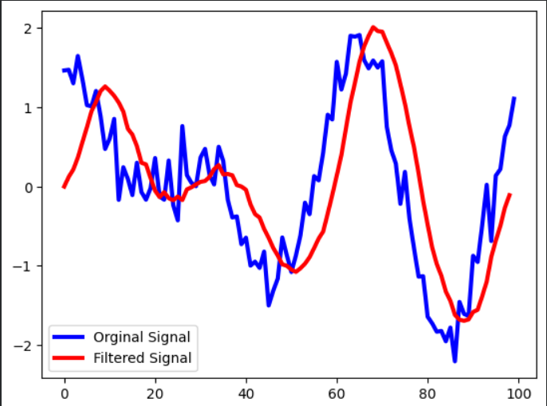

# Finite Impulse Response (FIR) Filter — Moving Average

A hardware implementation of an 8-tap Moving Average FIR filter written in Verilog, simulated and verified using Xilinx Vivado.

---

## Overview

A Moving Average FIR filter smooths an input signal by averaging the current and previous N-1 samples.  
It acts as a **low-pass filter**, attenuating high-frequency noise while preserving the underlying signal trend.

**Transfer function (8-tap):**

$$y[n] = \frac{1}{8} \sum_{k=0}^{7} x[n-k]$$

All 8 coefficients are equal: `h[k] = 1/8`

---

## Repository Structure

| File | Description |
|------|-------------|
| `fir_filter.v` | RTL design — 8-tap moving average FIR filter module |
| `fir_filter_tb.v` | Testbench — sine wave input and output verification |
| `input.data` | Input samples generated using Python (sine wave) |
| `save.data` | Output samples captured from Vivado simulation |
| `FIR_filter.png` | Simulation waveform screenshot from Vivado |

---

## Module Description

### `fir_filter.v`
- Implements an 8-tap FIR moving average filter
- Synchronous reset and enable control
- Input: signed digital samples
- Output: filtered/averaged output samples

### `fir_filter_tb.v`
- Reads sine wave samples from `input.data`
- Applies samples to the filter module clock cycle by clock cycle
- Writes filtered output to `save.data`

---

## Simulation

### Tools Required
- Xilinx Vivado 2023.x
- Python 3.x + NumPy

### Steps to Run in Vivado

1. Create a new RTL project in Vivado
2. Add `fir_filter.v` as a **Design Source**
3. Add `fir_filter_tb.v` as a **Simulation Source**
4. Place `input.data` in the project root directory
5. Go to **Flow → Run Simulation → Run Behavioral Simulation**
6. Observe the waveform output

---

## Waveform


| Signal | Description |
|--------|-------------|
| `clk` | System clock |
| `reset` | Active-high synchronous reset |
| `enable` | Filter enable signal |
| `data_in` | Sine wave input samples |
| `data_out` | Filtered output (smoothed sine wave) |

---
## Python Verification (Google Colab)

The filter was also verified in Python/Colab by applying the moving average 
to a noisy sine wave and plotting the result.



- **Blue** — Original noisy sine wave input  
- **Red** — Filtered output (smoothed by 8-tap moving average)

The filtered signal clearly smooths out the high-frequency noise while 
following the underlying sine wave, confirming correct filter behaviour.

## Input Data Generation (Python)
```python
import numpy as np
import matplotlib.pyplot as plt
# This Function is used to perform the transformation from a signed binary to
# the signed decimal representation

def todecimal (x,bits):
  assert len(x) <= bits
  n=int(x,2)
  s=1<<(bits-1)
  return (n & s-1) - (n & s)

# Compute a binary representation of the filter coefficients
# no of coefficinets
tap=8
# for computing first scale, we want to represent filter co-efficients
# as for 8 bit numbers
N1=8
# this is used to convert the filter inputs to 16 bits signed values
N2=16
# this is the output width
N3=32

real_coefficient=(1/tap)

# bit representation of the co efficients
coeff_bit=np.binary_repr(int(real_coefficient*(2**(N1-1))),N1)
# double check, invert, it should be equal to real_coefficient
todecimal(coeff_bit, N1)/(2**(N1-1))
# to generate a test noisy harmonic signal
timeVector=np.linspace(0,2*np.pi,100)
output=np.sin(2*timeVector)+np.cos(3*timeVector)+0.3*np.random.randn(len(timeVector))
plt.plot(output)
plt.show()

# This noisy signal is represented by decimal numbers
# Transform Decimal into binary

# this list contains the N/2 bit signed representation of the sin sequence
list1=[]
for number in output:
  list1.append(np.binary_repr(int(number*(2**(N1-1))),N2))

# save the converted sequence to the data file
with open('input.data','w') as file:
  for number in list1:
    file.write(number + '\n')
read_b=[]
#read data
with open('save.data') as file:
  for line in file:
    read_b.append(line.rstrip('\n'))
#this list contains the converted values
n_l=[]
for by in read_b:
  n_l.append(todecimal(by,N3)/(2**(2*(N1-1))))

plt.plot(output,color='blue',linewidth=3,label='Orginal Signal')
plt.plot(n_l,color='red',linewidth=3,label='Filtered Signal')
plt.legend()
plt.savefig('results.png',dpi=600)
plt.show()```

---
